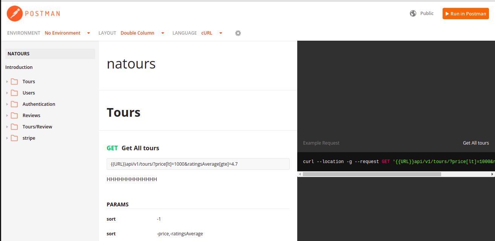

# Natours

An application showin information about tours, and helping users to booking their tour

## Installing / Getting started


```shell
npm install
npm run start:dev 
npm rung start:prod
npm run start:prodw -> windows
http://localhost:3000 -> for view 
```

## Developing

NodeJs, Express and MongoDB

### Built With
* express
* express-mongo-sanitize
* express-rate-limit
* helmet
* bcryptjs
* xss-clean
* cookie-parser
* cors
* dotenv
* mongoose
* jsonwebtoken
* nodemailer
* pug
* slugify
* stripe
* validator


### Deploying / Publishing
Heroku:

Test API : [API](https://sleepy-depths-27368.herokuapp.com/api/v1) 

ex: 
* tours
* users

view: 
Test view: [Natours](https://sleepy-depths-27368.herokuapp.com/)

## Api Reference

You can test API via postman using this documentation attached here -> [Postman documentation](https://documenter.getpostman.com/view/14845189/UVJhDaYA)




## Database

Using mongo atlas for database and controll the DB locally using Mongo Compass
